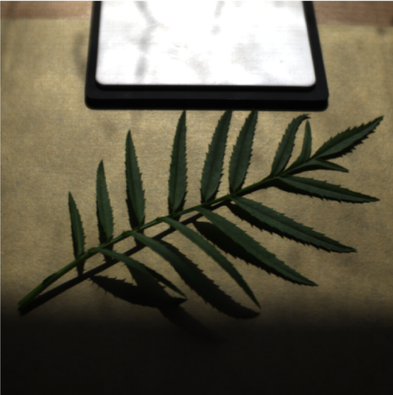
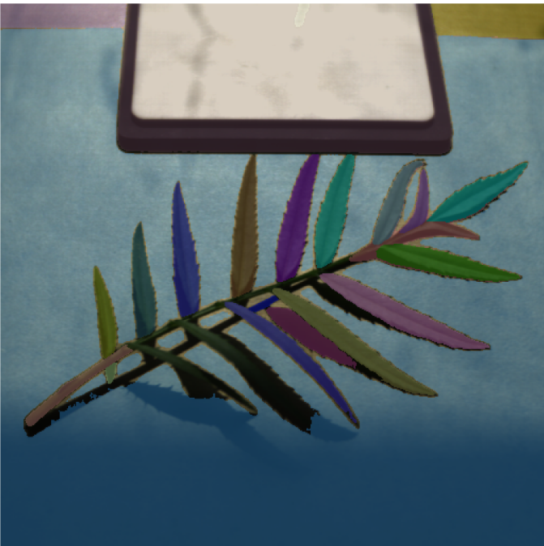
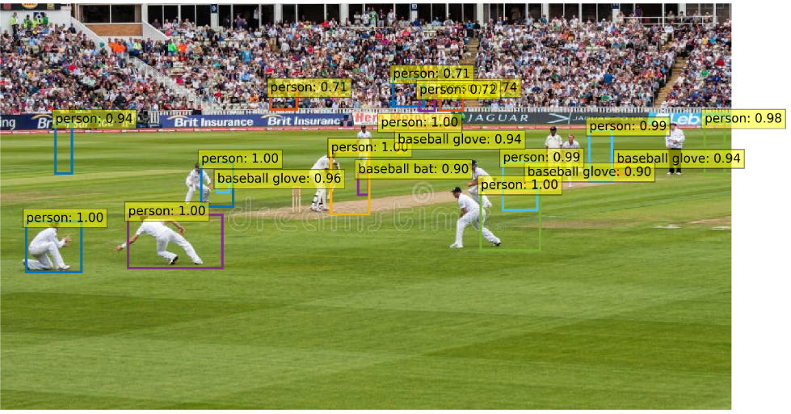

# 🖼️ Panoptic Segmentation & Object Detection

This project demonstrates **object detection and segmentation** using state-of-the-art models including **DETR**, **SAM**, and **SAM2**. The notebook (`.ipynb`) contains end-to-end code for panoptic segmentation and object detection tasks.
##
🖼️ Demo / GIF
## Segmentation Result
      
## Object Detection 
 | 
## Object detection 

  |  


---

## 🔹 Features
- **Object Detection** using DETR model  
- **Segmentation** using SAM and SAM2  
- **Panoptic Segmentation** to identify both object instances and semantic classes  
- End-to-end workflow in **Python / Jupyter Notebook**  

---

## 🛠️ Tech Stack
- Python 3.x  
- PyTorch  
- HuggingFace Transformers  
- OpenCV / PIL  
- Jupyter Notebook  

---

## 📂 Project Structure
```
project_root/
├── Panoptic_Segmentation.ipynb
├── notebook/sam2_finetuned
├── Object_Detection.ipynb
└── Panoptic_Segmentation.ipynb
```

## ⚙️ How to Run
1. **Clone the repository**
```bash
git clone https://github.com/your-username/your-repo.git
cd your-repo
```
##
Create virtual environment

    python -m venv venv
    source venv/bin/activate  # Linux / Mac
    venv\Scripts\activate     # Windows

##
💡 Usage

- Modify the input images in the notebook to test new datasets.

- Use DETR for detecting objects and SAM / SAM2 for segmenting them.

- Combine results for panoptic segmentation visualization.
##
📈 Results

- Accurate instance and semantic segmentation

- Smooth integration of detection and segmentation models

- Supports multiple object classes
##
📜 License

MIT License
##
👨‍💻 Author

Deepak Kumar
